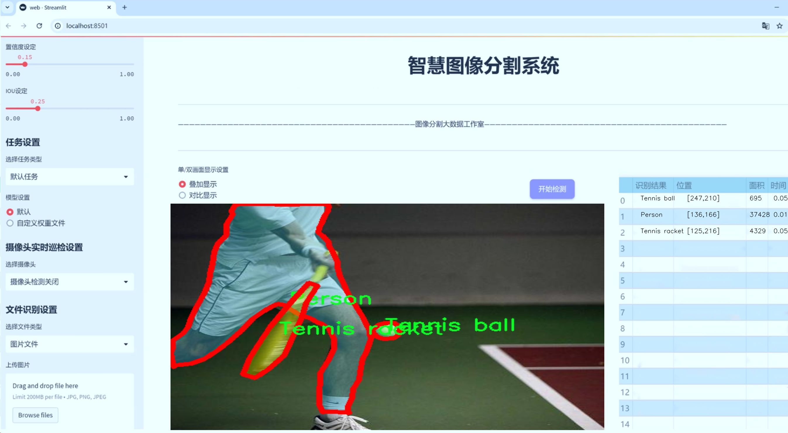
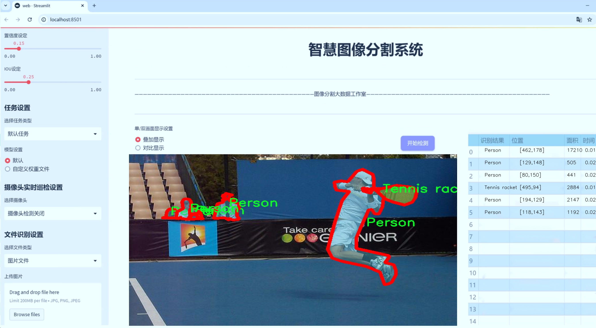
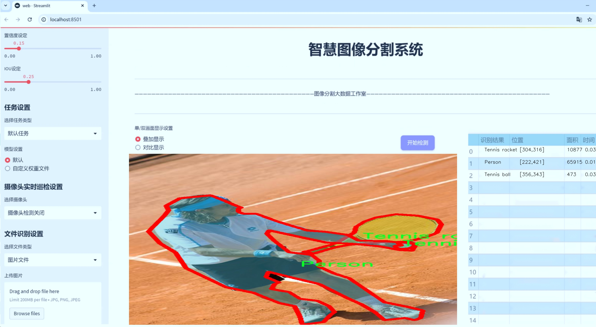
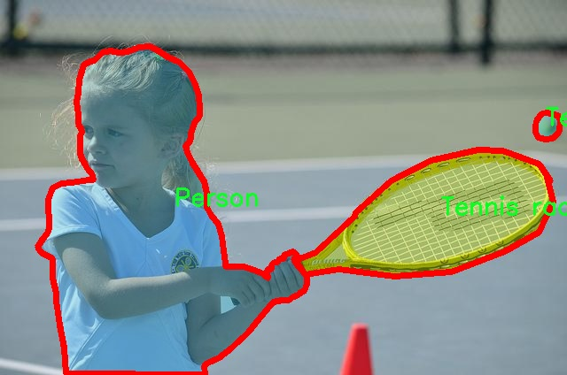
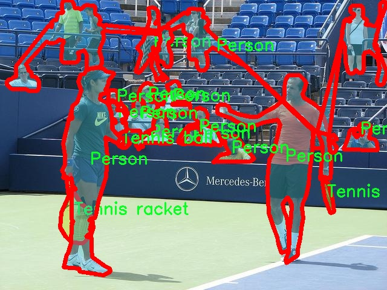
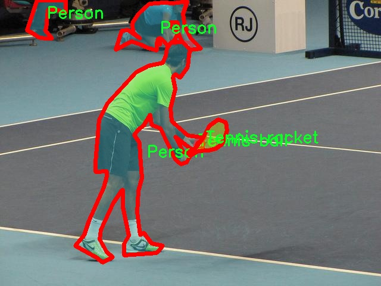
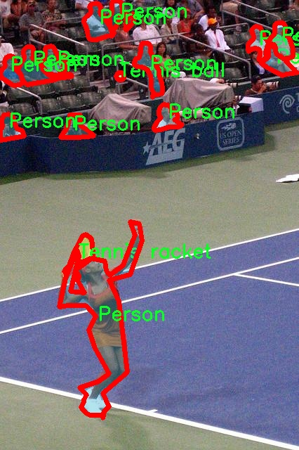
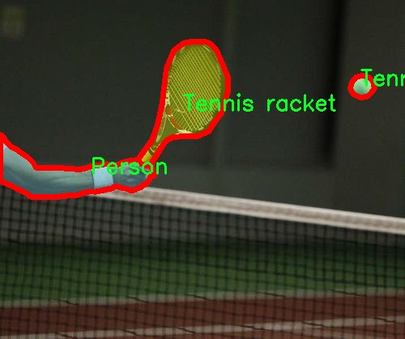

# 网球运动场景分割系统源码＆数据集分享
 [yolov8-seg-C2f-EMSC＆yolov8-seg-C2f-ODConv等50+全套改进创新点发刊_一键训练教程_Web前端展示]

### 1.研究背景与意义

项目参考[ILSVRC ImageNet Large Scale Visual Recognition Challenge](https://gitee.com/YOLOv8_YOLOv11_Segmentation_Studio/projects)

项目来源[AAAI Global Al lnnovation Contest](https://kdocs.cn/l/cszuIiCKVNis)

研究背景与意义

随着人工智能技术的迅猛发展，计算机视觉在各个领域的应用愈加广泛，尤其是在体育运动分析和场景理解方面。网球作为一项全球广受欢迎的运动，其比赛过程中的动态场景复杂多变，涉及到多种物体的实时识别与分割，如球员、球具及其他相关物品。因此，开发一个高效的网球运动场景分割系统，不仅可以为运动员提供战术分析的支持，还能为教练员和观众提供更直观的比赛信息，提升观赛体验。

在众多的计算机视觉算法中，YOLO（You Only Look Once）系列因其高效的实时目标检测能力而备受关注。YOLOv8作为该系列的最新版本，进一步提升了目标检测的精度和速度。然而，针对特定运动场景的分割任务，传统的YOLOv8模型在处理复杂背景和多类别物体时，仍然存在一定的局限性。因此，基于改进YOLOv8的网球运动场景分割系统的研究，具有重要的理论和实际意义。

本研究将基于一个包含4700张图像的数据集，涵盖15个类别，包括网球、网球拍、球员（男、女）、其他运动器材等。这些类别的多样性为模型的训练提供了丰富的样本，有助于提升分割系统在复杂场景下的表现。通过对YOLOv8进行改进，结合实例分割技术，我们期望能够实现对网球运动场景中各类物体的精确分割，进而提高模型在实时应用中的准确性和鲁棒性。

此外，随着数据集的不断扩展和技术的进步，基于深度学习的图像分割方法在体育领域的应用潜力巨大。通过对网球运动场景的深入研究，我们不仅可以推动计算机视觉技术的发展，还能为体育科学研究提供新的数据分析工具。运动员的动作分析、战术布局优化以及观众的互动体验等，都可以通过这一系统得到有效提升。

本研究的意义还在于为未来的研究提供参考。随着体育赛事的多样化，类似的分割系统可以扩展到其他运动项目中，如篮球、足球等。通过建立统一的模型框架和数据处理流程，研究者可以更方便地进行跨项目的比较与分析，推动体育运动领域的智能化发展。

综上所述，基于改进YOLOv8的网球运动场景分割系统的研究，不仅具有重要的学术价值，也为实际应用提供了广阔的前景。通过对复杂运动场景的精准理解，我们能够更好地服务于运动员、教练员和观众，推动体育科技的进步与发展。

### 2.图片演示







##### 注意：由于此博客编辑较早，上面“2.图片演示”和“3.视频演示”展示的系统图片或者视频可能为老版本，新版本在老版本的基础上升级如下：（实际效果以升级的新版本为准）

  （1）适配了YOLOV8的“目标检测”模型和“实例分割”模型，通过加载相应的权重（.pt）文件即可自适应加载模型。

  （2）支持“图片识别”、“视频识别”、“摄像头实时识别”三种识别模式。

  （3）支持“图片识别”、“视频识别”、“摄像头实时识别”三种识别结果保存导出，解决手动导出（容易卡顿出现爆内存）存在的问题，识别完自动保存结果并导出到tempDir中。

  （4）支持Web前端系统中的标题、背景图等自定义修改，后面提供修改教程。

  另外本项目提供训练的数据集和训练教程,暂不提供权重文件（best.pt）,需要您按照教程进行训练后实现图片演示和Web前端界面演示的效果。

### 3.视频演示

[3.1 视频演示](https://www.bilibili.com/video/BV1h6ycY6EQ2/)

### 4.数据集信息展示

##### 4.1 本项目数据集详细数据（类别数＆类别名）

nc: 3
names: ['Person', 'Tennis ball', 'Tennis racket']


##### 4.2 本项目数据集信息介绍

数据集信息展示

在本研究中，我们使用了名为“Tennis”的数据集，以支持对YOLOv8-seg模型在网球运动场景中的分割能力进行改进和优化。该数据集专门设计用于捕捉网球运动场景中的多种元素，具有丰富的视觉信息和多样的场景变化，旨在提升模型在实际应用中的表现。数据集包含三类主要对象，分别是“Person”（人）、“Tennis ball”（网球）和“Tennis racket”（网球拍），这些类别的选择不仅反映了网球运动的核心要素，也为模型的训练提供了多样化的标注数据。

在数据集的构建过程中，研究团队对每一类对象进行了精确的标注，以确保训练数据的高质量和高准确性。对于“Person”类别，数据集中包含了不同性别、年龄和体型的运动员在多种比赛和训练场景中的图像。这些图像不仅展示了运动员的动态姿态，还涵盖了不同的服装和装备，以模拟真实比赛中的多样性。这种多样化的标注使得模型能够更好地识别和分割运动员，提升其在复杂场景中的表现。

“Tennis ball”类别则包含了不同角度、不同光照条件下的网球图像。这些图像不仅包括在场地上静止的网球，还涵盖了运动员击球瞬间的动态图像。通过这样的数据收集，模型能够学习到网球在不同状态下的特征，从而在实际应用中实现更为精准的识别和分割。这一类别的丰富性为模型提供了良好的训练基础，使其能够在各种环境下保持高效的识别能力。

最后，“Tennis racket”类别的图像同样经过精心挑选，涵盖了多种类型的网球拍，包括不同品牌、不同设计和不同握把的拍子。这一类别的多样性不仅帮助模型学习到网球拍的形状和结构特征，还增强了其在复杂背景下的分割能力。通过对这些类别的综合训练，YOLOv8-seg模型将能够在真实的网球场景中实现高效的物体检测和分割，进而为后续的分析和应用提供支持。

综上所述，Tennis数据集通过对“Person”、“Tennis ball”和“Tennis racket”三类对象的全面覆盖，为YOLOv8-seg模型的训练提供了丰富的样本和高质量的标注。这一数据集不仅为模型的性能提升奠定了基础，也为未来在网球运动场景中的应用探索提供了重要的数据支持。通过对该数据集的深入分析和应用，我们期望能够实现更为精准的场景分割，推动网球运动相关技术的发展。











### 5.全套项目环境部署视频教程（零基础手把手教学）

[5.1 环境部署教程链接（零基础手把手教学）](https://www.bilibili.com/video/BV1jG4Ve4E9t/?vd_source=bc9aec86d164b67a7004b996143742dc)


[5.2 安装Python虚拟环境创建和依赖库安装视频教程链接（零基础手把手教学）](https://www.bilibili.com/video/BV1nA4VeYEze/?vd_source=bc9aec86d164b67a7004b996143742dc)

### 6.手把手YOLOV8-seg训练视频教程（零基础小白有手就能学会）

[6.1 手把手YOLOV8-seg训练视频教程（零基础小白有手就能学会）](https://www.bilibili.com/video/BV1cA4VeYETe/?vd_source=bc9aec86d164b67a7004b996143742dc)


按照上面的训练视频教程链接加载项目提供的数据集，运行train.py即可开始训练



     Epoch   gpu_mem       box       obj       cls    labels  img_size
     1/200     0G   0.01576   0.01955  0.007536        22      1280: 100%|██████████| 849/849 [14:42<00:00,  1.04s/it]
               Class     Images     Labels          P          R     mAP@.5 mAP@.5:.95: 100%|██████████| 213/213 [01:14<00:00,  2.87it/s]
                 all       3395      17314      0.994      0.957      0.0957      0.0843

     Epoch   gpu_mem       box       obj       cls    labels  img_size
     2/200     0G   0.01578   0.01923  0.007006        22      1280: 100%|██████████| 849/849 [14:44<00:00,  1.04s/it]
               Class     Images     Labels          P          R     mAP@.5 mAP@.5:.95: 100%|██████████| 213/213 [01:12<00:00,  2.95it/s]
                 all       3395      17314      0.996      0.956      0.0957      0.0845

     Epoch   gpu_mem       box       obj       cls    labels  img_size
     3/200     0G   0.01561    0.0191  0.006895        27      1280: 100%|██████████| 849/849 [10:56<00:00,  1.29it/s]
               Class     Images     Labels          P          R     mAP@.5 mAP@.5:.95: 100%|███████   | 187/213 [00:52<00:00,  4.04it/s]
                 all       3395      17314      0.996      0.957      0.0957      0.0845


### 7.50+种全套YOLOV8-seg创新点代码加载调参视频教程（一键加载写好的改进模型的配置文件）

[7.1 50+种全套YOLOV8-seg创新点代码加载调参视频教程（一键加载写好的改进模型的配置文件）](https://www.bilibili.com/video/BV1Hw4VePEXv/?vd_source=bc9aec86d164b67a7004b996143742dc)

### 8.YOLOV8-seg图像分割算法原理

原始YOLOV8-seg算法原理

YOLOv8-seg算法是2023年由Ultralytics公司推出的YOLO系列最新版本，旨在实现高效的目标检测与分割。作为YOLO系列的延续，YOLOv8-seg不仅继承了前几代算法的优点，还在结构设计和功能实现上进行了显著的改进，以适应日益复杂的计算机视觉任务。该算法的核心在于其高效的网络架构，特别是对于特征提取和多尺度信息融合的优化。

YOLOv8-seg的网络结构由输入层、主干网络、颈部网络和头部网络四个主要部分组成。输入层负责接收图像数据，并将其缩放至指定的输入尺寸，以满足网络的处理需求。主干网络是YOLOv8-seg的特征提取核心，采用了CSP（Cross Stage Partial）结构，将特征提取过程分为两部分：一部分进行卷积操作，另一部分则通过连接的方式增强特征信息的流动。这样的设计不仅提高了特征提取的效率，还增强了模型的梯度流，从而改善了检测和分割的效果。

在主干网络的末尾，YOLOv8-seg引入了SPPF（Spatial Pyramid Pooling Fast）模块，通过三个最大池化层处理多尺度特征。这一设计使得网络能够有效地捕捉不同尺度的目标信息，增强了特征的抽象能力，进而提升了模型的整体性能。SPPF模块的引入，不仅加快了计算速度，还提高了特征图的表达能力，使得YOLOv8-seg在处理复杂场景时表现得更加出色。

颈部网络则采用了PAN-FPN（Path Aggregation Network - Feature Pyramid Network）结构，旨在实现多尺度特征的融合。通过这一结构，YOLOv8-seg能够有效地整合来自不同层次的特征图信息，增强了对目标的检测和分割能力。PAN-FPN的设计理念在于通过跨层连接来加强特征信息的传递，使得高层特征与低层特征能够有效结合，从而提高模型对小目标和复杂背景的适应能力。

在检测网络方面，YOLOv8-seg采用了Anchor-Free的检测方式，这一创新使得模型在处理目标时不再依赖于预定义的锚框，从而减少了计算复杂度和调参的难度。检测模块使用了解耦头结构，通过两个并行的卷积分支分别计算回归和类别的损失，这种设计不仅提高了模型的灵活性，还增强了对不同类别目标的识别能力。

值得一提的是，YOLOv8-seg在损失函数的设计上也进行了优化，采用了CloU（Class-oriented Loss）损失函数。这一损失函数通过对不同类别的目标进行针对性优化，进一步提升了模型的检测精度和分割效果。CloU损失函数的引入，使得YOLOv8-seg在处理多类别目标时表现得更加稳健，能够有效降低误检和漏检的概率。

在实际应用中，YOLOv8-seg展现出了极高的灵活性和适应性，能够广泛应用于自动驾驶、智能监控、医疗影像分析等多个领域。其高效的特征提取和融合能力，使得该算法在处理复杂场景时，能够迅速而准确地识别和分割目标，满足了现代计算机视觉任务对实时性和准确性的双重需求。

综上所述，YOLOv8-seg算法通过创新的网络结构设计和高效的特征处理机制，成功实现了目标检测与分割的高效融合。其在主干网络、颈部网络及检测模块的优化，使得该算法在性能上得到了显著提升，为未来的计算机视觉研究提供了新的思路和方向。随着YOLOv8-seg的不断发展和完善，预计将在更多实际应用中发挥重要作用，推动计算机视觉技术的进一步进步。


### 9.系统功能展示（检测对象为举例，实际内容以本项目数据集为准）

图9.1.系统支持检测结果表格显示

  图9.2.系统支持置信度和IOU阈值手动调节

  图9.3.系统支持自定义加载权重文件best.pt(需要你通过步骤5中训练获得)

  图9.4.系统支持摄像头实时识别

  图9.5.系统支持图片识别

  图9.6.系统支持视频识别

  图9.7.系统支持识别结果文件自动保存

  图9.8.系统支持Excel导出检测结果数据


### 10.50+种全套YOLOV8-seg创新点原理讲解（非科班也可以轻松写刊发刊，V11版本正在科研待更新）

#### 10.1 由于篇幅限制，每个创新点的具体原理讲解就不一一展开，具体见下列网址中的创新点对应子项目的技术原理博客网址【Blog】：


[10.1 50+种全套YOLOV8-seg创新点原理讲解链接](https://gitee.com/qunmasj/good)

#### 10.2 部分改进模块原理讲解(完整的改进原理见上图和技术博客链接)【如果此小节的图加载失败可以通过CSDN或者Github搜索该博客的标题访问原始博客，原始博客图片显示正常】
### 全维动态卷积ODConv
鉴于上述讨论，我们的ODConv引入了一种多维注意机制，该机制具有并行策略，用于学习卷积核在核空间的所有四个维度上的不同注意。图提供了CondConv、DyConv和ODConv的示意性比较。

ODConv的公式：根据等式1中的符号，ODConv可定义为


 将注意力标量分配给整个卷积核。图2示出了将这四种类型的关注乘以n个卷积核的过程。原则上，这四种类型的关注是相互补充的，并且以位置、信道、滤波器和核的顺序将它们逐步乘以卷积核 
 ，使得卷积运算不同w.r.t.所有空间位置、所有输入信道、所有滤波器和输入x的所有核，提供捕获丰富上下文线索的性能保证。因此，ODConv可以显著增强CNN基本卷积运算的特征提取能力。此外，具有单个卷积核的ODConv可以与标准CondConv和DyConv竞争或优于它们，为最终模型引入的额外参数大大减少。提供了大量实验来验证这些优点。通过比较等式1和等式2，我们可以清楚地看到，ODConv是一种更广义的动态卷积。此外，当设置n=1且 所有分量均为1时，只关注滤波器方向 的ODConv将减少为：将基于输入特征的SE变量应用于卷积滤波器，然后进行卷积运算（注意原始SE（Hu等人，2018b）基于输出特征，并且用于重新校准输出特征本身）。这种SE变体是ODConv的特例。


图：将ODConv中的四种注意类型逐步乘以卷积核的示例。（a） 沿空间维度的逐位置乘法运算，（b）沿输入信道维度的逐信道乘法运算、（c）沿输出信道维度的按滤波器乘法运算，以及（d）沿卷积核空间的核维度的按核乘法运算。方法部分对符号进行了说明
实现：对于ODConv，一个关键问题是如何计算卷积核的四种关注度 。继CondConv和DyConv之后，我们还使用SE型注意力模块（Hu等人，2018b），但将多个头部作为来计算它们，其结构如图所示。具体而言，首先通过逐通道全局平均池（GAP）运算将输入压缩到具有长度的特征向量中。随后，存在完全连接（FC）层和四个头部分支。ReLU（Krizhevsky等人，2012）位于FC层之后。FC层将压缩特征向量映射到具有缩减比的低维空间（根据消融实验，我们在所有主要实验中设置 ，避免了高模型复杂度）。对于四个头部分支，每个分支都有一个输出大小如图。

### 引入ODConv的改进YOLO
参考这篇博客涵盖了引入ODConv的改进YOLOv8系统的内容，ODConv采用多维注意机制，在卷积核空间的四个维度上学习不同的注意。结合了CondConv和DyConv的优势，ODConv通过图示的四种注意类型逐步与卷积核相乘，以捕获丰富的上下文线索，提升特征提取能力。

#### ODConv结构与方法
ODConv的公式和图示展示了其关注力分配给卷积核的方式，其中四种类型的关注以位置、信道、滤波器和核的顺序逐步与卷积核相乘。这种结构保证了卷积运算不同于标准的Conv操作，能够捕获更多上下文信息，从而增强了CNN的特征提取能力。另外，单个卷积核的ODConv在性能上能够与CondConv和DyConv相竞争，并且引入的额外参数大幅减少。

ODConv的特殊之处在于其广义的动态卷积性质，同时在特定条件下（n=1且所有分量为1），它可以退化为一种特例，即只关注滤波器方向，这类似于基于输入特征的SE变体，但不同于原始SE，它基于输出特征。

#### ODConv的实现
关键问题在于如何计算卷积核的四种关注度。ODConv采用了SE型注意力模块，结合了多个头部来计算这些关注度。具体实现上，通过逐通道全局平均池运算和完全连接层，将输入压缩为特征向量，随后使用四个头部分支来计算四种不同类型的关注。这样的结构能在保持模型复杂度可控的情况下，提升了特征的表征能力。

ODConv的引入为YOLOv8带来了显著的性能提升，并且通过大量实验证明了其在特征提取方面的优越性。其结合了多维注意机制和卷积操作，为目标检测和分拣系统的提升带来了新的思路和性能突破。


### 11.项目核心源码讲解（再也不用担心看不懂代码逻辑）

#### 11.1 ultralytics\utils\callbacks\tensorboard.py

以下是对给定代码的核心部分进行提炼和详细注释的结果：

```python
# 导入必要的库和模块
from ultralytics.utils import LOGGER, SETTINGS, TESTS_RUNNING, colorstr

try:
    # 尝试导入TensorBoard的SummaryWriter
    from torch.utils.tensorboard import SummaryWriter

    # 确保当前不是在测试环境中
    assert not TESTS_RUNNING  
    # 确保TensorBoard集成已启用
    assert SETTINGS['tensorboard'] is True  
    WRITER = None  # 初始化TensorBoard的SummaryWriter实例

except (ImportError, AssertionError, TypeError):
    # 处理导入错误和断言错误
    SummaryWriter = None  # 如果导入失败，则将SummaryWriter设置为None


def _log_scalars(scalars, step=0):
    """将标量值记录到TensorBoard中。"""
    if WRITER:  # 如果WRITER已初始化
        for k, v in scalars.items():  # 遍历标量字典
            WRITER.add_scalar(k, v, step)  # 记录每个标量


def _log_tensorboard_graph(trainer):
    """将模型图记录到TensorBoard中。"""
    try:
        import warnings
        from ultralytics.utils.torch_utils import de_parallel, torch

        imgsz = trainer.args.imgsz  # 获取输入图像大小
        imgsz = (imgsz, imgsz) if isinstance(imgsz, int) else imgsz  # 确保图像大小为元组
        p = next(trainer.model.parameters())  # 获取模型参数以确定设备和类型
        im = torch.zeros((1, 3, *imgsz), device=p.device, dtype=p.dtype)  # 创建一个输入图像（必须为零）

        with warnings.catch_warnings():
            warnings.simplefilter('ignore', category=UserWarning)  # 忽略JIT跟踪警告
            WRITER.add_graph(torch.jit.trace(de_parallel(trainer.model), im, strict=False), [])  # 记录模型图
    except Exception as e:
        LOGGER.warning(f'WARNING ⚠️ TensorBoard图形可视化失败 {e}')  # 记录警告信息


def on_pretrain_routine_start(trainer):
    """在预训练例程开始时初始化TensorBoard记录。"""
    if SummaryWriter:  # 如果SummaryWriter可用
        try:
            global WRITER
            WRITER = SummaryWriter(str(trainer.save_dir))  # 初始化SummaryWriter
            prefix = colorstr('TensorBoard: ')
            LOGGER.info(f"{prefix}开始使用 'tensorboard --logdir {trainer.save_dir}'，可在 http://localhost:6006/ 查看")
        except Exception as e:
            LOGGER.warning(f'WARNING ⚠️ TensorBoard未正确初始化，未记录此次运行。 {e}')  # 记录警告信息


def on_train_start(trainer):
    """在训练开始时记录TensorBoard图形。"""
    if WRITER:  # 如果WRITER已初始化
        _log_tensorboard_graph(trainer)  # 记录模型图


def on_batch_end(trainer):
    """在训练批次结束时记录标量统计信息。"""
    _log_scalars(trainer.label_loss_items(trainer.tloss, prefix='train'), trainer.epoch + 1)  # 记录训练损失


def on_fit_epoch_end(trainer):
    """在训练周期结束时记录周期指标。"""
    _log_scalars(trainer.metrics, trainer.epoch + 1)  # 记录训练指标


# 定义回调函数字典
callbacks = {
    'on_pretrain_routine_start': on_pretrain_routine_start,
    'on_train_start': on_train_start,
    'on_fit_epoch_end': on_fit_epoch_end,
    'on_batch_end': on_batch_end
} if SummaryWriter else {}
```

### 代码核心部分分析：
1. **TensorBoard集成**：代码通过`SummaryWriter`实现与TensorBoard的集成，确保在训练过程中可以记录和可视化模型的训练过程。
2. **日志记录函数**：定义了多个函数用于记录标量数据和模型图形，便于在TensorBoard中查看训练过程中的关键指标。
3. **回调机制**：使用回调函数在训练的不同阶段（如预训练开始、训练开始、批次结束和周期结束）记录数据，提供了灵活的日志记录方式。

### 注释说明：
- 每个函数都有明确的文档字符串，说明其功能。
- 代码中包含了错误处理和警告记录，以确保在出现问题时能够及时反馈。
- 通过条件判断确保只有在`SummaryWriter`可用时才进行记录，避免因导入失败导致的错误。

这个文件是一个用于与TensorBoard集成的回调模块，主要用于在训练过程中记录和可视化模型的训练过程。首先，文件导入了一些必要的模块和工具，包括日志记录器（LOGGER）、设置（SETTINGS）和一些颜色字符串工具（colorstr）。接着，它尝试从PyTorch的`torch.utils.tensorboard`中导入`SummaryWriter`，这是TensorBoard的主要接口。如果导入失败，或者在测试运行时，或者设置中未启用TensorBoard集成，则会捕获相应的异常并将`SummaryWriter`设置为`None`。

在这个模块中，定义了几个函数。`_log_scalars`函数用于将标量值记录到TensorBoard中，它接受一个字典类型的参数`scalars`，并将其中的每个键值对记录到TensorBoard。`_log_tensorboard_graph`函数则用于将模型的计算图记录到TensorBoard。它首先获取输入图像的大小，然后创建一个全零的张量作为输入，使用`torch.jit.trace`对模型进行跟踪，并将结果添加到TensorBoard中。如果在这个过程中发生异常，会记录警告信息。

接下来是几个回调函数，它们在训练的不同阶段被调用。`on_pretrain_routine_start`函数在预训练例程开始时被调用，用于初始化TensorBoard的记录器，并输出相关信息以指导用户如何查看TensorBoard。`on_train_start`函数在训练开始时被调用，用于记录模型的计算图。`on_batch_end`函数在每个训练批次结束时被调用，记录当前批次的标量统计信息。`on_fit_epoch_end`函数在每个训练周期结束时被调用，记录当前周期的指标。

最后，文件定义了一个`callbacks`字典，包含了上述回调函数的映射关系，如果`SummaryWriter`可用的话。这个字典可以在训练过程中被调用，以便在适当的时机记录相关信息到TensorBoard中。总的来说，这个模块的主要目的是提供一个简洁的接口，以便在训练YOLO模型时，能够方便地记录和可视化训练过程中的各种信息。

#### 11.2 ui.py

以下是代码中最核心的部分，并附上详细的中文注释：

```python
import sys
import subprocess

def run_script(script_path):
    """
    使用当前 Python 环境运行指定的脚本。

    Args:
        script_path (str): 要运行的脚本路径

    Returns:
        None
    """
    # 获取当前 Python 解释器的路径
    python_path = sys.executable

    # 构建运行命令，使用 streamlit 运行指定的脚本
    command = f'"{python_path}" -m streamlit run "{script_path}"'

    # 执行命令，并等待其完成
    result = subprocess.run(command, shell=True)
    
    # 检查命令执行的返回码，如果不为0则表示出错
    if result.returncode != 0:
        print("脚本运行出错。")

# 主程序入口
if __name__ == "__main__":
    # 指定要运行的脚本路径
    script_path = "web.py"  # 假设脚本在当前目录下

    # 调用函数运行指定的脚本
    run_script(script_path)
```

### 代码注释说明：
1. **导入模块**：
   - `sys`：用于访问与 Python 解释器紧密相关的变量和函数。
   - `subprocess`：用于生成新进程、连接到它们的输入/输出/错误管道，并获得它们的返回码。

2. **定义 `run_script` 函数**：
   - 该函数接受一个参数 `script_path`，表示要运行的 Python 脚本的路径。
   - 使用 `sys.executable` 获取当前 Python 解释器的路径，以确保在正确的环境中运行脚本。
   - 构建命令字符串，使用 `streamlit` 模块运行指定的脚本。
   - 使用 `subprocess.run` 执行构建的命令，并等待其完成。
   - 检查返回码，如果返回码不为0，表示脚本运行出错，并打印错误信息。

3. **主程序入口**：
   - 使用 `if __name__ == "__main__":` 确保只有在直接运行该脚本时才会执行以下代码。
   - 指定要运行的脚本路径（这里假设为 `web.py`）。
   - 调用 `run_script` 函数，传入脚本路径以执行该脚本。

这个程序文件名为 `ui.py`，主要功能是使用当前的 Python 环境来运行一个指定的脚本，具体是一个名为 `web.py` 的文件。程序首先导入了必要的模块，包括 `sys`、`os` 和 `subprocess`，以及一个自定义的 `abs_path` 函数，用于获取脚本的绝对路径。

在 `run_script` 函数中，首先获取当前 Python 解释器的路径，使用 `sys.executable` 来实现。接着，构建一个命令字符串，这个命令使用 `streamlit` 来运行指定的脚本。`streamlit` 是一个用于构建数据应用的库，这里通过 `-m` 参数来指定模块运行。

然后，使用 `subprocess.run` 来执行这个命令，`shell=True` 表示在一个新的 shell 中执行该命令。执行完后，程序会检查返回码，如果返回码不为零，说明脚本运行出错，此时会打印出错误信息。

在文件的最后部分，使用 `if __name__ == "__main__":` 来确保只有在直接运行该脚本时才会执行下面的代码。这里指定了要运行的脚本路径，即 `web.py`，并调用 `run_script` 函数来执行它。

总体来说，这个程序的作用是为 `web.py` 提供一个启动入口，通过 `streamlit` 来运行它，方便用户在当前的 Python 环境中启动数据应用。

#### 11.3 ultralytics\engine\trainer.py

以下是经过简化并添加详细中文注释的核心代码部分：

```python
class BaseTrainer:
    """
    BaseTrainer类用于创建训练器的基类。

    属性:
        args (SimpleNamespace): 训练器的配置。
        model (nn.Module): 模型实例。
        device (torch.device): 用于训练的设备。
        trainset (torch.utils.data.Dataset): 训练数据集。
        testset (torch.utils.data.Dataset): 测试数据集。
        optimizer (torch.optim.Optimizer): 优化器实例。
        epochs (int): 训练的总轮数。
    """

    def __init__(self, cfg=DEFAULT_CFG, overrides=None):
        """
        初始化BaseTrainer类。

        参数:
            cfg (str, optional): 配置文件路径，默认为DEFAULT_CFG。
            overrides (dict, optional): 配置覆盖，默认为None。
        """
        self.args = get_cfg(cfg, overrides)  # 获取配置
        self.device = select_device(self.args.device, self.args.batch)  # 选择设备
        self.model = None  # 初始化模型
        self.trainset, self.testset = None, None  # 初始化训练和测试集
        self.optimizer = None  # 初始化优化器
        self.epochs = self.args.epochs  # 设置训练轮数

    def train(self):
        """开始训练过程。"""
        self._setup_train()  # 设置训练环境
        for epoch in range(self.epochs):
            self.model.train()  # 设置模型为训练模式
            for batch in self.train_loader:  # 遍历训练数据
                self.optimizer.zero_grad()  # 清空梯度
                loss = self.model(batch)  # 前向传播计算损失
                loss.backward()  # 反向传播计算梯度
                self.optimizer.step()  # 更新参数

    def _setup_train(self):
        """设置训练的必要组件，如数据加载器和优化器。"""
        self.train_loader = self.get_dataloader(self.trainset)  # 获取训练数据加载器
        self.optimizer = self.build_optimizer(self.model)  # 构建优化器

    def get_dataloader(self, dataset):
        """返回数据加载器。"""
        # 这里需要实现具体的数据加载逻辑
        raise NotImplementedError('get_dataloader函数未实现')

    def build_optimizer(self, model):
        """构建优化器。"""
        return optim.Adam(model.parameters(), lr=self.args.lr)  # 使用Adam优化器

# 下面是具体的使用示例
trainer = BaseTrainer(cfg='path/to/config.yaml')
trainer.train()  # 开始训练
```

### 代码说明：
1. **BaseTrainer类**：这是一个用于训练模型的基类，包含了训练所需的基本配置和方法。
2. **__init__方法**：初始化训练器，设置配置、设备、模型和数据集等。
3. **train方法**：执行训练过程，遍历每个epoch和每个batch，进行前向传播、反向传播和参数更新。
4. **_setup_train方法**：设置训练所需的组件，包括数据加载器和优化器。
5. **get_dataloader方法**：这是一个未实现的方法，应该返回训练数据的加载器。
6. **build_optimizer方法**：构建优化器，这里使用Adam优化器。

通过这些核心部分和注释，可以更好地理解训练过程的基本框架和实现逻辑。

这个程序文件是Ultralytics YOLO（You Only Look Once）模型的训练引擎，主要用于在给定数据集上训练YOLO模型。文件中包含了一个名为`BaseTrainer`的类，作为训练的基础类，提供了训练过程中的各种功能和配置。

在文件开头，首先导入了一些必要的库和模块，包括数学运算、文件操作、时间处理、深度学习框架PyTorch及其相关模块等。接着，定义了`BaseTrainer`类，并在类文档字符串中描述了其功能和属性。

在`__init__`方法中，初始化了训练器的配置，包括从配置文件中获取参数、选择设备（CPU或GPU）、创建保存结果的目录、设置模型和数据集等。还进行了随机种子的初始化，以确保训练的可重复性。类的属性包括模型、数据集、优化器、学习率调度器、损失函数等。

`add_callback`和`set_callback`方法用于管理训练过程中的回调函数，这些回调函数可以在训练的不同阶段执行特定的操作。`run_callbacks`方法则用于运行与特定事件相关的所有回调函数。

`train`方法是训练的主入口，根据设备的数量（单GPU或多GPU）选择不同的训练方式。如果是多GPU训练，会生成相应的命令并通过子进程运行；否则，直接调用`_do_train`方法进行训练。

`_setup_ddp`和`_setup_train`方法分别用于初始化分布式数据并行（DDP）训练的参数和设置训练所需的模型、数据加载器、优化器等。在`_do_train`方法中，进行实际的训练循环，包括前向传播、反向传播、优化步骤等。训练过程中会记录损失、学习率等信息，并在每个epoch结束时进行验证和模型保存。

`save_model`方法用于保存模型的检查点，包括当前的epoch、最佳的fitness值、模型参数、优化器状态等。`validate`方法用于在验证集上评估模型的性能，并返回相应的指标。

文件中还定义了一些辅助方法，例如`build_optimizer`用于构建优化器，`preprocess_batch`用于对输入数据进行预处理，`final_eval`用于在训练结束后进行最终评估等。

总的来说，这个文件实现了YOLO模型的训练过程，包括模型的初始化、数据加载、训练循环、验证和模型保存等功能，提供了一个完整的训练框架。

#### 11.4 ultralytics\models\yolo\segment\predict.py

以下是代码中最核心的部分，并附上详细的中文注释：

```python
from ultralytics.engine.results import Results  # 导入结果处理类
from ultralytics.models.yolo.detect.predict import DetectionPredictor  # 导入检测预测类
from ultralytics.utils import DEFAULT_CFG, ops  # 导入默认配置和操作工具

class SegmentationPredictor(DetectionPredictor):
    """
    扩展自DetectionPredictor类的分割预测类。
    """

    def __init__(self, cfg=DEFAULT_CFG, overrides=None, _callbacks=None):
        """初始化SegmentationPredictor，使用提供的配置、覆盖参数和回调函数。"""
        super().__init__(cfg, overrides, _callbacks)  # 调用父类构造函数
        self.args.task = 'segment'  # 设置任务类型为分割

    def postprocess(self, preds, img, orig_imgs):
        """对每个输入图像的预测结果进行后处理，包括非极大值抑制和掩膜处理。"""
        # 应用非极大值抑制，过滤掉重叠的框
        p = ops.non_max_suppression(preds[0],
                                    self.args.conf,  # 置信度阈值
                                    self.args.iou,  # IOU阈值
                                    agnostic=self.args.agnostic_nms,  # 是否进行类别无关的NMS
                                    max_det=self.args.max_det,  # 最大检测数量
                                    nc=len(self.model.names),  # 类别数量
                                    classes=self.args.classes)  # 指定的类别

        # 如果输入图像不是列表，转换为numpy数组
        if not isinstance(orig_imgs, list):
            orig_imgs = ops.convert_torch2numpy_batch(orig_imgs)

        results = []  # 存储结果的列表
        proto = preds[1][-1] if len(preds[1]) == 3 else preds[1]  # 获取掩膜原型

        # 遍历每个预测结果
        for i, pred in enumerate(p):
            orig_img = orig_imgs[i]  # 获取原始图像
            img_path = self.batch[0][i]  # 获取图像路径

            if not len(pred):  # 如果没有检测到框
                masks = None  # 掩膜为None
            elif self.args.retina_masks:  # 如果使用Retina掩膜
                # 缩放边界框到原始图像大小
                pred[:, :4] = ops.scale_boxes(img.shape[2:], pred[:, :4], orig_img.shape)
                # 处理掩膜
                masks = ops.process_mask_native(proto[i], pred[:, 6:], pred[:, :4], orig_img.shape[:2])  # HWC
            else:  # 否则使用普通掩膜处理
                masks = ops.process_mask(proto[i], pred[:, 6:], pred[:, :4], img.shape[2:], upsample=True)  # HWC
                # 缩放边界框到原始图像大小
                pred[:, :4] = ops.scale_boxes(img.shape[2:], pred[:, :4], orig_img.shape)

            # 将结果添加到结果列表中
            results.append(Results(orig_img, path=img_path, names=self.model.names, boxes=pred[:, :6], masks=masks))
        
        return results  # 返回处理后的结果
```

### 代码核心部分说明：
1. **类定义**：`SegmentationPredictor`类继承自`DetectionPredictor`，用于实现基于分割模型的预测。
2. **初始化方法**：构造函数中调用父类的构造函数，并设置任务类型为分割。
3. **后处理方法**：`postprocess`方法负责对模型的预测结果进行后处理，包括非极大值抑制和掩膜的生成，最终返回处理后的结果列表。

这个程序文件是一个用于图像分割预测的类定义，名为 `SegmentationPredictor`，它继承自 `DetectionPredictor` 类。该类的主要功能是对输入的图像进行分割预测，利用YOLO（You Only Look Once）模型进行处理。

在文件开头，首先导入了一些必要的模块和类，包括 `Results`、`DetectionPredictor` 和一些工具函数 `ops`。这些导入为后续的类定义和方法实现提供了基础。

`SegmentationPredictor` 类的构造函数 `__init__` 接受三个参数：配置 `cfg`、覆盖参数 `overrides` 和回调 `_callbacks`。在构造函数中，调用了父类的构造函数，并将任务类型设置为 'segment'，表明该类专注于图像分割任务。

`postprocess` 方法是该类的核心功能之一。它负责对模型的预测结果进行后处理，包括非极大值抑制（NMS）和掩膜处理。该方法接收三个参数：`preds`（模型的预测结果）、`img`（输入图像）和 `orig_imgs`（原始图像）。首先，使用 `ops.non_max_suppression` 函数对预测结果进行非极大值抑制，以减少冗余的检测框。接着，检查输入的原始图像是否为列表格式，如果不是，则将其转换为NumPy数组格式。

在处理每个预测结果时，程序会判断预测框的数量。如果没有检测到目标，则设置掩膜为 `None`。如果启用了 `retina_masks`，则会调用相应的函数处理掩膜；否则，使用另一种方法进行掩膜处理。无论哪种情况，都会对预测框进行缩放，以适应原始图像的尺寸。最后，将处理后的结果存储在 `results` 列表中，每个结果包含原始图像、图像路径、类别名称、检测框和掩膜。

总的来说，这个文件定义了一个专门用于图像分割的预测器类，提供了初始化和后处理的功能，使得用户能够方便地使用YOLO模型进行图像分割任务。通过示例代码，用户可以快速上手，加载模型并进行预测。

#### 11.5 train.py

以下是经过简化和注释的核心代码部分：

```python
import os
import torch
import yaml
from ultralytics import YOLO  # 导入YOLO模型库

if __name__ == '__main__':  # 确保该模块被直接运行时才执行以下代码
    # 设置训练参数
    workers = 1  # 数据加载的工作进程数
    batch = 8  # 每个批次的样本数量
    device = "0" if torch.cuda.is_available() else "cpu"  # 检查是否有可用的GPU

    # 获取数据集配置文件的绝对路径
    data_path = abs_path(f'datasets/data/data.yaml', path_type='current')

    # 读取YAML文件，保持原有顺序
    with open(data_path, 'r') as file:
        data = yaml.load(file, Loader=yaml.FullLoader)

    # 修改数据路径为绝对路径
    if 'train' in data and 'val' in data and 'test' in data:
        directory_path = os.path.dirname(data_path.replace(os.sep, '/'))  # 获取目录路径
        data['train'] = directory_path + '/train'  # 更新训练集路径
        data['val'] = directory_path + '/val'      # 更新验证集路径
        data['test'] = directory_path + '/test'    # 更新测试集路径

        # 将修改后的数据写回YAML文件
        with open(data_path, 'w') as file:
            yaml.safe_dump(data, file, sort_keys=False)

    # 加载YOLO模型配置文件和预训练权重
    model = YOLO(r"C:\codeseg\codenew\50+种YOLOv8算法改进源码大全和调试加载训练教程（非必要）\改进YOLOv8模型配置文件\yolov8-seg-C2f-Faster.yaml").load("./weights/yolov8s-seg.pt")

    # 开始训练模型
    results = model.train(
        data=data_path,  # 指定训练数据的配置文件路径
        device=device,    # 指定训练设备
        workers=workers,  # 指定数据加载的工作进程数
        imgsz=640,        # 输入图像的大小
        epochs=100,       # 训练的轮数
        batch=batch,      # 每个批次的样本数量
    )
```

### 代码注释说明：
1. **导入必要的库**：导入了处理文件路径、深度学习模型、YAML文件解析等所需的库。
2. **主程序入口**：使用`if __name__ == '__main__':`确保代码仅在直接运行时执行。
3. **设置训练参数**：定义了数据加载的工作进程数、批次大小和设备类型（GPU或CPU）。
4. **获取数据集配置文件路径**：使用`abs_path`函数获取数据集的YAML配置文件的绝对路径。
5. **读取和修改YAML文件**：读取YAML文件，更新训练、验证和测试数据的路径为绝对路径，并将修改后的内容写回文件。
6. **加载YOLO模型**：加载YOLO模型的配置文件和预训练权重。
7. **开始训练模型**：调用`model.train`方法开始训练，传入必要的参数如数据路径、设备、工作进程数、图像大小、训练轮数和批次大小。

这个程序文件 `train.py` 是一个用于训练 YOLO（You Only Look Once）模型的脚本，主要用于目标检测或分割任务。程序首先导入了一些必要的库，包括 `os`、`torch`、`yaml` 和 `ultralytics` 中的 YOLO 模型，以及用于处理路径的 `QtFusion.path` 和绘图库 `matplotlib`。

在主程序中，首先设置了一些训练参数，如工作进程数 `workers`、批次大小 `batch`，并根据系统是否支持 CUDA 来选择设备（GPU 或 CPU）。接着，程序通过 `abs_path` 函数获取数据集配置文件 `data.yaml` 的绝对路径，并将其转换为 UNIX 风格的路径，以便后续处理。

程序读取 YAML 文件，解析其中的数据，并检查是否包含训练、验证和测试集的路径。如果存在这些路径，程序会将其修改为绝对路径并写回 YAML 文件。这一步是为了确保模型能够正确找到数据集。

接下来，程序加载 YOLO 模型的配置文件和预训练权重。这里使用的是一个特定的 YOLOv8 模型配置文件 `yolov8-seg-C2f-Faster.yaml`，并加载对应的权重文件 `yolov8s-seg.pt`。程序中还提到，不同的模型对设备的要求不同，如果出现错误，可以尝试其他模型配置文件。

最后，程序调用 `model.train()` 方法开始训练模型，传入的数据配置文件路径、设备、工作进程数、输入图像大小、训练轮数和批次大小等参数。这一部分是模型训练的核心，指定了训练的基本设置。

总体来说，这个脚本提供了一个完整的训练流程，从数据集路径的处理到模型的加载和训练，适合用于 YOLO 模型的训练任务。

#### 11.6 ultralytics\nn\backbone\EfficientFormerV2.py

以下是简化后的代码，保留了核心部分，并添加了详细的中文注释：

```python
import torch
import torch.nn as nn
import math
import itertools

class Attention4D(nn.Module):
    """4D注意力机制模块"""
    def __init__(self, dim=384, key_dim=32, num_heads=8, attn_ratio=4, resolution=7):
        super().__init__()
        self.num_heads = num_heads  # 注意力头的数量
        self.scale = key_dim ** -0.5  # 缩放因子
        self.key_dim = key_dim  # 键的维度
        self.resolution = resolution  # 输入分辨率
        self.N = resolution ** 2  # 分辨率的平方，表示注意力矩阵的大小

        # 定义查询、键、值的卷积层
        self.q = nn.Conv2d(dim, num_heads * key_dim, kernel_size=1)
        self.k = nn.Conv2d(dim, num_heads * key_dim, kernel_size=1)
        self.v = nn.Conv2d(dim, num_heads * attn_ratio * key_dim, kernel_size=1)

        # 定义输出的卷积层
        self.proj = nn.Sequential(
            nn.ReLU(),
            nn.Conv2d(num_heads * attn_ratio * key_dim, dim, kernel_size=1)
        )

        # 计算注意力偏置
        points = list(itertools.product(range(resolution), range(resolution)))
        attention_offsets = {}
        idxs = []
        for p1 in points:
            for p2 in points:
                offset = (abs(p1[0] - p2[0]), abs(p1[1] - p2[1]))
                if offset not in attention_offsets:
                    attention_offsets[offset] = len(attention_offsets)
                idxs.append(attention_offsets[offset])
        self.attention_biases = nn.Parameter(torch.zeros(num_heads, len(attention_offsets)))
        self.register_buffer('attention_bias_idxs', torch.LongTensor(idxs).view(self.N, self.N))

    def forward(self, x):
        """前向传播"""
        B, C, H, W = x.shape  # B: batch size, C: channel, H: height, W: width

        # 计算查询、键、值
        q = self.q(x).view(B, self.num_heads, self.key_dim, -1).permute(0, 1, 3, 2)
        k = self.k(x).view(B, self.num_heads, self.key_dim, -1).permute(0, 1, 2, 3)
        v = self.v(x).view(B, self.num_heads, -1, -1).permute(0, 1, 3, 2)

        # 计算注意力
        attn = (q @ k) * self.scale + self.attention_biases[:, self.attention_bias_idxs]
        attn = attn.softmax(dim=-1)  # softmax归一化

        # 计算输出
        x = (attn @ v).permute(0, 1, 3, 2).reshape(B, -1, self.resolution, self.resolution)
        out = self.proj(x)  # 投影到输出维度
        return out


class EfficientFormerV2(nn.Module):
    """EfficientFormer V2模型"""
    def __init__(self, layers, embed_dims):
        super().__init__()
        self.patch_embed = nn.Conv2d(3, embed_dims[0], kernel_size=3, stride=2, padding=1)  # 输入层

        # 构建网络
        self.network = nn.ModuleList()
        for i in range(len(layers)):
            stage = nn.Sequential(*[Attention4D(embed_dims[i]) for _ in range(layers[i])])  # 每个阶段的多个注意力模块
            self.network.append(stage)

    def forward(self, x):
        """前向传播"""
        x = self.patch_embed(x)  # 输入图像经过嵌入层
        for block in self.network:
            x = block(x)  # 通过每个阶段的模块
        return x


def efficientformerv2_s0():
    """创建EfficientFormer V2 S0模型"""
    model = EfficientFormerV2(layers=[2, 2, 6, 4], embed_dims=[32, 48, 96, 176])  # 定义层数和嵌入维度
    return model


if __name__ == '__main__':
    inputs = torch.randn((1, 3, 640, 640))  # 创建一个随机输入
    model = efficientformerv2_s0()  # 创建模型
    res = model(inputs)  # 前向传播
    print(res.size())  # 输出结果的尺寸
```

### 代码注释说明：
1. **Attention4D类**：实现了一个4D注意力机制模块，主要负责计算输入特征的注意力表示。
   - 初始化时定义了查询、键、值的卷积层，并计算注意力偏置。
   - 在`forward`方法中，计算查询、键、值的表示，并根据注意力机制计算输出。

2. **EfficientFormerV2类**：构建了EfficientFormer V2模型。
   - 在初始化时，定义了输入层和多个注意力模块的网络结构。
   - 在`forward`方法中，依次通过输入层和每个阶段的模块。

3. **efficientformerv2_s0函数**：创建S0版本的EfficientFormer V2模型，定义了层数和嵌入维度。

4. **主程序**：创建一个随机输入，实例化模型并进行前向传播，最后输出结果的尺寸。

这个程序文件实现了一个名为 `EfficientFormerV2` 的深度学习模型，主要用于图像处理任务。文件中包含了多个类和函数，构成了模型的不同组件和功能。

首先，文件导入了一些必要的库，包括 PyTorch 及其相关模块。接着，定义了一些模型的参数，包括不同版本的宽度和深度配置（如 `EfficientFormer_width` 和 `EfficientFormer_depth`），这些参数决定了模型的复杂度和性能。

接下来，定义了多个类，分别实现了模型的不同部分。`Attention4D` 类实现了一个四维注意力机制，允许模型在空间上进行有效的信息聚合。该类的构造函数中定义了多个卷积层和注意力机制的参数，并在 `forward` 方法中实现了前向传播逻辑。

`Embedding` 类用于将输入图像转换为嵌入表示，使用卷积层进行特征提取。`Mlp` 类实现了一个多层感知机（MLP），用于进一步处理特征。`AttnFFN` 和 `FFN` 类则结合了注意力机制和前馈网络，形成了模型的基本构建块。

`eformer_block` 函数用于构建模型的各个块，结合了不同的层和注意力机制。`EfficientFormerV2` 类是整个模型的核心，负责整合所有的模块，并定义了模型的结构和前向传播过程。

在模型的构造过程中，可以根据需要选择不同的层数、嵌入维度、下采样策略等参数。模型的输出可以根据配置返回不同层的特征图。

最后，文件中还定义了一些辅助函数，如 `update_weight` 用于加载预训练权重，`efficientformerv2_s0` 等函数用于创建不同配置的模型实例。

在 `__main__` 部分，程序示例了如何创建不同版本的 `EfficientFormerV2` 模型，并对随机生成的输入进行前向传播，输出每个模型的特征图大小。这部分代码可以用于测试模型的功能和性能。

总体来说，这个文件实现了一个灵活且高效的图像处理模型，适用于各种计算机视觉任务。

### 12.系统整体结构（节选）

### 整体功能和构架概括

该项目是一个基于Ultralytics YOLO（You Only Look Once）模型的计算机视觉框架，主要用于目标检测和图像分割任务。项目的架构模块化，包含多个文件和类，负责不同的功能，包括模型训练、预测、数据处理、回调管理和可视化等。以下是各个模块的主要功能：

- **模型定义与构建**：实现了YOLO和EfficientFormer等模型的结构，支持不同的网络配置和参数设置。
- **训练与评估**：提供了训练引擎，支持数据加载、模型训练、验证和保存模型等功能。
- **预测与推理**：实现了对输入图像的预测功能，包括目标检测和分割。
- **回调与可视化**：集成了TensorBoard等工具，用于记录训练过程中的指标和可视化结果。
- **用户界面**：提供了简单的用户界面脚本，方便用户启动和运行模型。

### 文件功能整理表

| 文件路径                                       | 功能描述                                                                                     |
|----------------------------------------------|------------------------------------------------------------------------------------------|
| `ultralytics/utils/callbacks/tensorboard.py` | 集成TensorBoard，记录训练过程中的指标和可视化结果。                                            |
| `ui.py`                                      | 提供用户界面入口，运行指定的脚本（如`web.py`），方便用户启动数据应用。                          |
| `ultralytics/engine/trainer.py`             | 实现YOLO模型的训练引擎，管理训练过程，包括数据加载、模型训练、验证和保存模型等功能。               |
| `ultralytics/models/yolo/segment/predict.py` | 实现图像分割的预测功能，处理模型的预测结果并进行后处理。                                       |
| `train.py`                                   | 训练YOLO模型的主脚本，负责配置参数、加载数据集和模型，启动训练过程。                           |
| `ultralytics/nn/backbone/EfficientFormerV2.py` | 定义EfficientFormerV2模型的结构，包含多个组件如注意力机制、嵌入层和前馈网络等。                  |
| `ultralytics/models/yolo/model.py`          | 定义YOLO模型的核心结构和功能，包括前向传播和模型初始化等。                                     |
| `ultralytics/models/__init__.py`             | 初始化YOLO模型模块，提供模型的导入和使用接口。                                               |
| `chinese_name_list.py`                       | 可能包含中文名称列表，供模型训练或评估时使用（具体功能需查看文件内容）。                         |
| `ultralytics/nn/backbone/convnextv2.py`     | 定义ConvNeXtV2模型的结构，提供卷积神经网络的实现。                                          |
| `ultralytics/models/rtdetr/train.py`         | 实现RT-DETR模型的训练逻辑，可能用于实时目标检测任务。                                        |
| `ultralytics/trackers/bot_sort.py`          | 实现Bot SORT（Simple Online and Realtime Tracking）算法，用于目标跟踪。                        |
| `ultralytics/utils/patches.py`               | 提供一些工具函数和补丁，可能用于模型的兼容性和功能扩展。                                     |

以上表格整理了每个文件的功能，帮助理解项目的整体架构和各个模块的职责。

注意：由于此博客编辑较早，上面“11.项目核心源码讲解（再也不用担心看不懂代码逻辑）”中部分代码可能会优化升级，仅供参考学习，完整“训练源码”、“Web前端界面”和“50+种创新点源码”以“14.完整训练+Web前端界面+50+种创新点源码、数据集获取”的内容为准。

### 13.图片、视频、摄像头图像分割Demo(去除WebUI)代码

在这个博客小节中，我们将讨论如何在不使用WebUI的情况下，实现图像分割模型的使用。本项目代码已经优化整合，方便用户将分割功能嵌入自己的项目中。
核心功能包括图片、视频、摄像头图像的分割，ROI区域的轮廓提取、类别分类、周长计算、面积计算、圆度计算以及颜色提取等。
这些功能提供了良好的二次开发基础。

### 核心代码解读

以下是主要代码片段，我们会为每一块代码进行详细的批注解释：

```python
import random
import cv2
import numpy as np
from PIL import ImageFont, ImageDraw, Image
from hashlib import md5
from model import Web_Detector
from chinese_name_list import Label_list

# 根据名称生成颜色
def generate_color_based_on_name(name):
    ......

# 计算多边形面积
def calculate_polygon_area(points):
    return cv2.contourArea(points.astype(np.float32))

...
# 绘制中文标签
def draw_with_chinese(image, text, position, font_size=20, color=(255, 0, 0)):
    image_pil = Image.fromarray(cv2.cvtColor(image, cv2.COLOR_BGR2RGB))
    draw = ImageDraw.Draw(image_pil)
    font = ImageFont.truetype("simsun.ttc", font_size, encoding="unic")
    draw.text(position, text, font=font, fill=color)
    return cv2.cvtColor(np.array(image_pil), cv2.COLOR_RGB2BGR)

# 动态调整参数
def adjust_parameter(image_size, base_size=1000):
    max_size = max(image_size)
    return max_size / base_size

# 绘制检测结果
def draw_detections(image, info, alpha=0.2):
    name, bbox, conf, cls_id, mask = info['class_name'], info['bbox'], info['score'], info['class_id'], info['mask']
    adjust_param = adjust_parameter(image.shape[:2])
    spacing = int(20 * adjust_param)

    if mask is None:
        x1, y1, x2, y2 = bbox
        aim_frame_area = (x2 - x1) * (y2 - y1)
        cv2.rectangle(image, (x1, y1), (x2, y2), color=(0, 0, 255), thickness=int(3 * adjust_param))
        image = draw_with_chinese(image, name, (x1, y1 - int(30 * adjust_param)), font_size=int(35 * adjust_param))
        y_offset = int(50 * adjust_param)  # 类别名称上方绘制，其下方留出空间
    else:
        mask_points = np.concatenate(mask)
        aim_frame_area = calculate_polygon_area(mask_points)
        mask_color = generate_color_based_on_name(name)
        try:
            overlay = image.copy()
            cv2.fillPoly(overlay, [mask_points.astype(np.int32)], mask_color)
            image = cv2.addWeighted(overlay, 0.3, image, 0.7, 0)
            cv2.drawContours(image, [mask_points.astype(np.int32)], -1, (0, 0, 255), thickness=int(8 * adjust_param))

            # 计算面积、周长、圆度
            area = cv2.contourArea(mask_points.astype(np.int32))
            perimeter = cv2.arcLength(mask_points.astype(np.int32), True)
            ......

            # 计算色彩
            mask = np.zeros(image.shape[:2], dtype=np.uint8)
            cv2.drawContours(mask, [mask_points.astype(np.int32)], -1, 255, -1)
            color_points = cv2.findNonZero(mask)
            ......

            # 绘制类别名称
            x, y = np.min(mask_points, axis=0).astype(int)
            image = draw_with_chinese(image, name, (x, y - int(30 * adjust_param)), font_size=int(35 * adjust_param))
            y_offset = int(50 * adjust_param)

            # 绘制面积、周长、圆度和色彩值
            metrics = [("Area", area), ("Perimeter", perimeter), ("Circularity", circularity), ("Color", color_str)]
            for idx, (metric_name, metric_value) in enumerate(metrics):
                ......

    return image, aim_frame_area

# 处理每帧图像
def process_frame(model, image):
    pre_img = model.preprocess(image)
    pred = model.predict(pre_img)
    det = pred[0] if det is not None and len(det)
    if det:
        det_info = model.postprocess(pred)
        for info in det_info:
            image, _ = draw_detections(image, info)
    return image

if __name__ == "__main__":
    cls_name = Label_list
    model = Web_Detector()
    model.load_model("./weights/yolov8s-seg.pt")

    # 摄像头实时处理
    cap = cv2.VideoCapture(0)
    while cap.isOpened():
        ret, frame = cap.read()
        if not ret:
            break
        ......

    # 图片处理
    image_path = './icon/OIP.jpg'
    image = cv2.imread(image_path)
    if image is not None:
        processed_image = process_frame(model, image)
        ......

    # 视频处理
    video_path = ''  # 输入视频的路径
    cap = cv2.VideoCapture(video_path)
    while cap.isOpened():
        ret, frame = cap.read()
        ......
```


### 14.完整训练+Web前端界面+50+种创新点源码、数据集获取


# [下载链接：https://mbd.pub/o/bread/Zp2YlJpw](https://mbd.pub/o/bread/Zp2YlJpw)